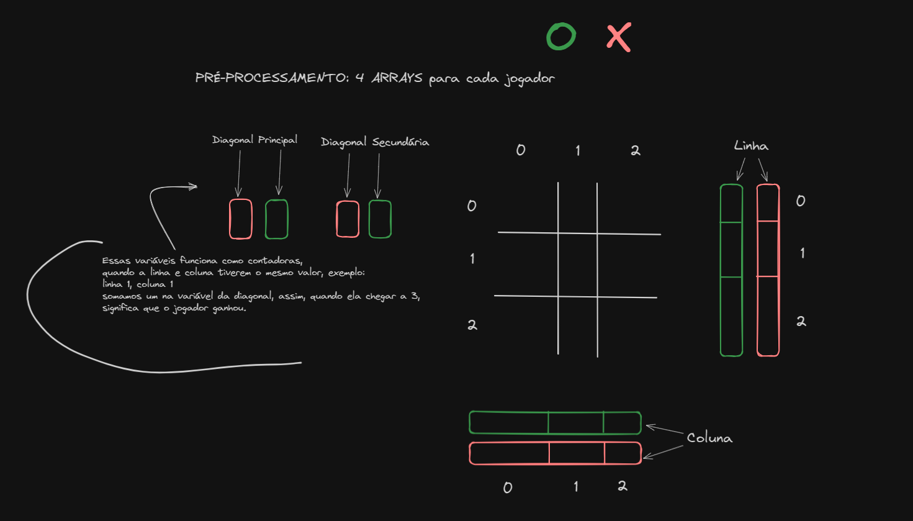

Isso é apenas um jogo da velha bem otimizado.

Explicando o algoritimo: <br>
#### [Rodando o jogo](https://youtu.be/zLJRv9zqJ2s?si=qHwYgUH2K69Ojzi2)
#### [Explicando o algoritimo](https://youtu.be/1WuQXfJU4Ck?si=xEacTKQMhBHpjmPi)


#### README: Compilação e Execução do Projeto "hash.c"

## Compilação do Projeto
1. Navegue para o diretório onde o arquivo "hash.c" está localizado.

2. Abra um terminal no diretório.

3. Para compilar o projeto, use o seguinte comando:

```bash
gcc hash.c -o hash
```

Isso irá compilar o código fonte e criar um arquivo executável no mesmo diretório.

## Execução do Projeto
Para executar o projeto compilado, basta digitar o seguinte comando no terminal:

```bash
./hash
```


### Código

Aqui, é definida uma estrutura Player que contém um caractere typePlayer. Será usada para representar os jogadores do jogo.

```c
    typedef struct {
        char typePlayer;
    } Player;
````

A estrutura Game representa o tabuleiro do jogo com uma matriz 3x3 de caracteres.

```c
    typedef struct {
        char Table[3][3];
    } Game;

```

GamePositionXO é uma estrutura que mantém o controle das jogadas de ambos os jogadores. Ela inclui arrays para rastrear as colunas e linhas preenchidas por 'X' e 'O', bem como variáveis para rastrear as diagonais.

```c
    typedef struct {
        int ColumnX[3];
        int LineX[3];
        int ColumnO[3];
        int LineO[3];
    
        int MainDiagonalX;
        int SecondaryDiagonalX;
        int MainDiagonalO;
        int SecondaryDiagonalO;
    } GamePositionXO;
```

RenderTable é uma função que imprime o tabuleiro na tela.

```c
    void renderTable(Game *game) {
        int i = 0, j = 0;

        while (i <= 2) {
            while (j <= 2) {
                printf("%c", game->Table[i][j]);
                if (j != 2)
                    printf(" | ");
                fflush(stdin);
                j++;
            }
            if (i != 2)
                printf("\n--|---|--\n");
            i++;
            j = 0;
        }
    }

```

validationForPosition é uma função que verifica se a posição escolhida pelo jogador é válida (não preenchida e dentro dos limites do tabuleiro).

```c
    int validationForPosition(Game *game, int optionLine, int optionColumn, char turn) {
        if (optionLine > 2 || optionColumn > 2) {
            printf("\n Erro: voce escolheu uma posicao inexistente");
            return 1;
        }
        if (game->Table[optionLine][optionColumn] != ' '){
            printf("\n Erro: voce escolheu uma posicao preenchida");
            return 1;
        }
        return 0;
    }

```

insertTable é uma função que coloca a jogada atual no tabuleiro e atualiza a estrutura GamePositionXO de acordo com as jogadas.

```c
    int insertTable(Game *game, GamePositionXO *gamePosition, int optionLine, int optionColumn, char turn, int round) {
        
        game->Table[optionLine][optionColumn] = turn;
        
        if (turn == 'X') {
            gamePosition->ColumnX[optionColumn] += 1;
            gamePosition->LineX[optionLine] += 1;
            if(optionColumn == optionLine){
                gamePosition->MainDiagonalX += 1;
            }
            if((optionColumn + optionLine) == 2) {
                gamePosition->SecondaryDiagonalX += 1;
            }
            if (gamePosition->ColumnX[optionColumn] == 3 || gamePosition->LineX[optionLine] == 3|| gamePosition->MainDiagonalX == 3 || gamePosition->SecondaryDiagonalX == 3) {
                return 1; 
            }
        }
        else if (turn == 'O') {
            gamePosition->ColumnO[optionColumn] += 1;
            gamePosition->LineO[optionLine] += 1;
            
            if(optionColumn == optionLine){
                gamePosition->MainDiagonalO += 1;
            }
            
            if((optionColumn + optionLine) ==2){
                    gamePosition->SecondaryDiagonalO += 1;
            }
        
            if (gamePosition->ColumnO[optionColumn] == 3 || gamePosition->LineO[optionLine] == 3 ||  gamePosition->MainDiagonalO == 3 || gamePosition->SecondaryDiagonalO == 3)
                return 1; // VULGO VITORA
        }
        return 0;
    }

```

roundGame é uma função que solicita a próxima jogada ao jogador atual.

```c 
void roundGame() {
    printf("\n turn do jogador %c:", turn);
    fflush(stdin);
    printf("\n Escolha a posicao (linha) %c:", turn);
    scanf("%d", &optionLine);
    printf("\n Escolha a posicao (coluna) %c:", turn);
    scanf("%d", &optionColumn);
}
```

Aqui começa a função principal do jogo. Ela cria um objeto Game para representar o tabuleiro, configura os jogadores (player1 e player2), e começa um loop que permite que os jogadores façam suas jogadas até que alguém vença ou empate. A cada rodada, a função roundGame é chamada para obter a jogada do jogador atual, e as funções validationForPosition e insertTable são usadas para verificar e aplicar a jogada. O jogo continua até que haja um vencedor ou um empate.


```c 
    int main() {
        Game game = {{
            {' ', ' ', ' '},
            {' ', ' ', ' '},
            {' ', ' ', ' '}
        }};

        renderTable(&game);
        
        Player player1;
        Player player2;
        GamePositionXO gamePosition = {0, 0.0f, '\0'};
        
        int round = 1;
        player1.typePlayer = 'X';
        player2.typePlayer = 'O';

        while (1) {
            roundGame();
            if (validationForPosition(&game, optionLine, optionColumn, turn)){
                continue;
            }
            
            int result = insertTable(&game, &gamePosition, optionLine, optionColumn, turn, round);
            
            if (result == 1){
                renderTable(&game);
                printf("\nO jogador %c ganhou!", turn);
                break;
            }

            renderTable(&game);

            turn = (turn == 'X' ? 'O' : 'X');
            round++;
        }
    }

```

### Representação visual:



# Mostrando jogo funcionando


